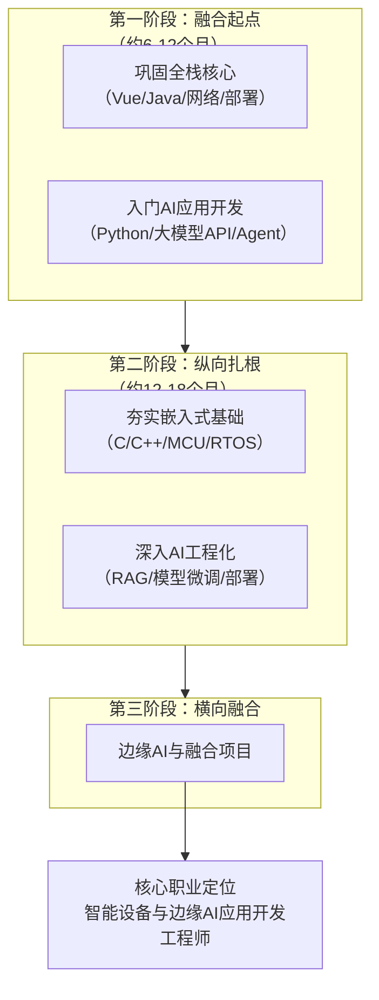

问：20251206
目前我在纠结我的职业未来选择的问题，我不知道该深挖什么方向，往什么方向上去扩展，先说说我现在的情况：
1. 我目前刚满28岁，已婚有一子，同时居住在成都双流，没有房贷车贷困扰
2.我目前学历是大专，然后在一家小型企业做前端开发，月薪一万
3. 我现在技术栈主要是前端方面，JS HTML CSS VUE，原生小程序也会一点，也会一些鸿蒙开发，后端Java也会，但是主要是做前端，我入行就在做前端，大概做了有五年吧，接近五年，其中gap大概占一年半
4. 工作经历和项目经历上，首先我经历的几家公司都是五十人以下的小公司，甚至有两三家是二十人以下的，叫办公室都不为过，项目经历上，几乎都是做的后台管理系统，小程序，没有什么特别有难点亮点的项目
5. 目前呢前端我感觉我的基础薄弱，面试很吃力，加上我的学历，经历，让我找工作非常的难，所以我一直在持续的扩展我的技术栈，希望作为全栈提高我的竞争力
6. 但是现在我回过神，我发现我前端吧勉勉强强算是一个中级开发，Java 小程序 鸿蒙都是接触过，只能说入门，感觉做项目吧也只能说是够用，很多高级知识点， 一问就废，一做不会
7. 所以就导致了我很困扰，因为马上就三十岁了，工作也不是那么稳定，所以我就在考虑我的职业发展问题
8. 首先一个，我很难转行，因为我现在也没有什么其他比较好的转行路线，其次是我除了写代码也不会什么，去学吧感觉我这个学历可能还不如在互联网IT干呢，但是现在这些接触的工作和公司让我感觉我就是在慢性自杀
9. 所以，我今年的九月左右，开始自己研发APP，就是鸿蒙APP，因为鸿蒙APP本身是前端语言转写，然后又支持个人应用上架，所以，我就想试着看能不能先当成一个副业和兴趣发展一下，万一可以的话还能多笔收入，但是，急于上线，所以我几乎都是使用的AI代替我去开发APP，导致我的时间花了，但是技术几乎没有成长，但你不让我用AI，独立开发实在太耗费时间了，说不定等我研发出来，市场环境都更加恶劣了
10. 所以我现在又在思考我未来的职业发展，就是现在市场行情上，程序员的市场环境以及学历限制都越来越严格，工作不好找，而且我觉得我也应该有一个专业的方法去深挖，这样以后或许能够更加好找工作，而不是样样通 样样松的样子
11. 所以现在我很迷茫，也很痛苦，但又无奈，现在英语又不好，又想学英语，又想开发APP（不论如何，我都想做完这款APP，然后上架了以后再说），又想巩固基础提供技术能力，让我能够更好的应对面试，又想做很多项目，或者开源项目，去给简历提供亮点，方面以后找工作
12. 所以现在看到了几个方向，一个是AI方向，现在AI应用很火嘛，什么应用都想接入AI能力，包括我的APP我以后也想接入AI，但是我感觉这个方向比较虚幻，就是泡沫，说不定哪天这个泡沫就破了，然后市场没了，就像以前的互联网泡沫一样，现在的市场很多AI初创公司都疯狂跑出来捞钱，投资人也爱投资，所以市场工资还是比较高的，但我就怕我到时候好不容易学完了，市场环境变了。
还有一个方向就是嵌入式开发，我觉得如果AI以现在的增长速度持续进化下去，那么以后AI的能力接入到硬件设备，能够大大提高各种设备的下限，例如摄像头，传感器，智能家居等等，所以我觉得学习嵌入式，然后能够把AI接入到硬件设备中，应该也会有一些市场，
但我不知道，事情会不会如我想象中这么发展，万一我进去了，AI还是没有如我想象中的那样，大幅提高设备智能能力，那么又怎么办呢？毕竟嵌入式现在的行情跟互联网环境相比还是很有差距的，而且出差啊，难度啊，都不一样，毕竟我转行的话还是零基础，几乎都要从头开始学嵌入式相关的技能，时间成本巨高，收益也很有风险
但是我吧，又有点厌倦了写什么后台系统这种简单的无聊的系统，因为排除业务逻辑的问题，现在的AI开发后台管理系统就跟喝水一样简单，无非就是排错能力的问题和上下文不能覆盖整个项目导致容易出Bug的问题，但是都能靠人力解决
而且我现在在准备专升本，至少两年内，我会尝试在现在这家公司苟住，然后自己想好方向了以后，一方面维护自己的APP，一方面应付好工作内容，保证不被优化，其次的业务时间就要用来学习英语，和技术方面的知识，然后尝试开发一些开源项目，逐渐提升自己的技术能力和提高知名度，帮我下一次找工作的时候能够去一个更好更稳定的平台。

所以我想你从一个专业的职业规划家，市场分析人员，经济学家，科学家，程序员的角度综合理解一下我说的这些话，然后搜索一下大量关于我说的内容的市场相关消息，来帮我分析一下，规划一下我的职业发展路线，我到底该怎么做，才能让我下一份工作能够提高收入，更加稳定，然后坚定一个方向持续深挖，避免35岁自动转行的问题，给我提供合理的分析和建议

答：20251206
### **综合评估：你的现状与市场环境**
根据你的描述，我理解你正处在职业生涯的关键节点，面临着“技术深度不足、学历门槛限制、发展方向模糊”带来的焦虑。这种焦虑在28-35岁的开发者中非常普遍，但好消息是，你已清晰地认识到问题，并开始积极寻求改变。

首先，我们对你的处境和市场环境进行一个综合画像：

*   **个人情况**：28岁，5年前端经验（含空窗期），技术栈广度尚可但深度不足。大专学历正在提升，家庭稳定（无负债）是重要优势。
*   **本地市场（成都）**：成都不乏高质量的互联网岗位，但对人才的要求正在向“高精尖”或“一专多能”靠拢。例如，成都双流区的前端职位普遍要求**本科及以上学历**，并强调**主流框架深度应用、架构设计、性能优化和高难度技术攻关**能力，月薪范围可达18K-25K。这与你目前在小公司处理常规业务的经历存在差距。
*   **全国趋势**：IT行业正经历结构性调整。普通开发岗位竞争激烈（一个职位可能收到超40份简历），但**AI、大模型、架构等高端岗位却人才紧缺**（投递比低至1：7），薪酬也显著更高。同时，企业越来越看重开发者**将AI工具融入工作流的能力**（如GitHub Copilot），以及**全栈化的技术视野**。
*   **你的迷思**：你考虑的“AI应用开发”和“嵌入式+AI”方向，分别对应了市场的上层应用和底层硬件融合，都是有前景的赛道。但**直接、零基础转向这两个领域的核心研发，对你而言成本极高且风险巨大**。更务实的策略是，**以你现有的前端/全栈技能为基石，向其中一个方向进行“延伸”，而非“重造”**。

### **职业发展路线规划：T型深化与战略延伸**
基于以上分析，我为你设计了一条“**立足全栈，深化前端，战略延伸**”的五年规划路径。核心是构建坚实的“T”字型能力结构：一横（全栈广度）保证就业宽度和竞争力，一竖（前端或特定领域深度）建立专业壁垒，抵御年龄风险。

#### **📈 第一阶段：夯实根基，突破瓶颈（未来1-2年）**
**目标**：稳住当前工作，完成专升本学历提升，系统补强技术短板，实现从小公司到中型/稳定平台的跃迁，目标月薪15K-20K+。
*   **1. 学历与基础（重中之重）**：按计划完成**专升本**。这是叩开优质公司大门的硬性条件。同时，用半年时间，以面试为导向，死磕**JavaScript/Vue底层原理**（如响应式、虚拟DOM、Diff算法）、**浏览器工作原理**、**高性能编程与网络协议**。
*   **2. 技术栈升级**：
    *   **前端深度**：将Vue 3 + TypeScript作为主力技术栈，并学习其**生态和高级特性**（Composition API、Vite、Pinia）。掌握前端工程化（Webpack/Vite配置）、性能分析与优化、数据可视化（如ECharts）。
    *   **全栈拓展**：将你“会一点”的Java系统化。学习**Spring Boot**，并能独立开发包含用户认证、权限管理、RESTful API的完整后端服务。同时学习**MySQL**数据库设计和优化，以及**Redis**缓存。这是你成为全栈工程师的基石。
*   **3. 项目与作品集重构**：
    *   **立即停止纯AI生成代码**。将你的鸿蒙APP作为**学习型项目**，亲自编码实现核心功能，这本身就是极佳的技术证明。
    *   **创造“技术亮点”**：从你熟悉的“后台管理系统”中跳出来，开发一个**有复杂状态管理、前后端分离、并集成可视化图表**的个人作品（例如：个人财务分析系统、智能家居控制中心模拟平台）。将其部署上云，代码开源在GitHub，并撰写详细的技术文档。
    *   **拥抱AI工具的正确姿势**：将AI（如Cursor、Copilot）定位为**高级助手**，用于代码解释、生成重复代码片段、提供优化建议。重点学习 **“提示词工程”** ，以提升效率，而非替代思考。

#### **🚀 第二阶段：建立壁垒，塑造优势（第3-5年）**
**目标**：成为团队核心技术骨干或初级技术管理者，年收入实现显著增长，并确立长期发展的技术品牌。
*   **方向选择与战略延伸**：此时，你有两个高潜力方向可以选择，均基于你第一阶段的全栈能力：

| 延伸方向 | 发展路径 | 需强化的核心技能 | 市场价值与风险 |
| :--- | :--- | :--- | :--- |
| **A. 前端架构 / 可视化专家** | 在前端领域纵向挖深，成为解决复杂问题、定技术方案的专家。 | 前端架构设计（微前端、模块化）、复杂数据可视化（WebGL/Three.js）、跨端统一解决方案（Uni-app/Taro）、性能极致优化。 | **价值高**：是企业数字化的关键角色，经验越深越稀缺。**风险低**：路径平滑，与你现有工作衔接紧密。 |
| **B. AI应用层/大模型前端工程师** | 将全栈能力与AI结合，专注于AI能力的**产品化与界面实现**，而非创造AI模型本身。 | 大模型API调用（如OpenAI、文心一言）、AI Agent基础概念、Prompt工程、向量数据库基础、开发AI原生应用界面。 | **价值极高**：紧贴“AI驱动”的行业浪潮，人才缺口大。**风险中等**：需持续学习新工具，但技术栈与你现有能力兼容。 |

*   **建议**：**优先考虑方向B（AI应用层）**。它能最大化利用你前端的视觉化优势和全栈的工程能力，且市场溢价明显。你可以从为你的鸿蒙APP或新项目集成一个智能对话功能开始实践。
*   **软技能与影响力**：
    *   在团队内主动承担技术分享、代码评审，培养**技术领导力**。
    *   在技术社区（如掘金、GitHub）持续输出高质量内容，**打造个人技术品牌**。

#### **🔮 第三阶段：跨越周期，实现价值（5年后）**
**目标**：成为领域内的资深专家、架构师或技术管理者，完全摆脱“可替代性”焦虑。
*   **路径一（技术线）**：在前端架构或AI应用工程领域深耕，成为能够规划公司级技术方案、攻克行业级难题的专家。
*   **路径二（管理线）**：转向技术管理，负责团队建设、项目规划和跨部门协作。
*   **路径三（复合线）**：结合技术积累和对特定行业（如你提到的物流、金融）的理解，成为“技术+业务”的复合型人才，这是抵御年龄风险的最强护城河。

### **关于你其他疑虑的解答**
*   **AI方向是泡沫吗？** 短期内存在局部过热，但长期看，AI如同当年的互联网和移动互联网，是**生产力范式的变革**。泡沫会破，但趋势不会。你需要警惕的是“只懂调参的伪AI工程师”，但成为 **“懂AI的应用程序工程师”** 则需求持久。
*   **嵌入式+AI要不要转？** 这是一个硬件与智能融合的宏大方向，但**不适合现在的你直接转型**。它需要全新的知识体系（电子、通信、嵌入式OS），且初期薪资可能不如互联网。建议作为**长期兴趣**，在主线职业稳定后，用业余时间通过开发板（如树莓派）做小项目探索。
*   **英语、开源项目的重要性**：英语是阅读一手资料、参与国际社区的关键，**建议以“用”代学**，比如直接阅读英文官方文档。参与开源项目是简历的超级亮点，**可以从提交文档、修复简单bug开始**，关键是迈出第一步。

### **行动路线图与优先级排序**
时间有限，请按以下优先级分配你的精力：

1.  **第一优先级（每日/每周坚持）**：
    *   **学历提升**：按计划推进专升本。
    *   **前端深度**：每天1小时系统学习原理，死磕一个技术点。
    *   **项目实践**：重构你的鸿蒙APP或启动一个新全栈项目，亲自编码。
2.  **第二优先级（每月/每季度规划）**：
    *   **全栈技能**：系统学习Spring Boot和数据库，并能独立完成一个小型全栈应用。
    *   **准备面试**：根据目标职位要求（参考），刷题、整理项目难点和解决方案。
3.  **第三优先级（长期培养）**：
    *   **方向延伸**：开始了解并实践大模型API的调用，尝试开发一个AI功能小demo。
    *   **建立影响力**：写一篇技术博客，分享你的学习心得或项目总结。

你28岁的年龄和已婚已育的状态，在带来责任感的同时，也意味着你拥有比年轻人更强的定力和对长期主义的理解。35岁危机本质是“性价比”危机和“技能陈旧”危机。通过未来2-3年聚焦而有策略的深耕，你完全可以在30-32岁时，凭借 **“扎实的全栈功底 + 前沿的AI应用能力/或深厚的架构经验”** 的组合，成功进入更具发展潜力的平台，将年龄转化为经验优势。

放弃“样样通”的想法，选择一条路，然后像钉子一样扎进去。你的技术生涯，现在重新开始，正当其时。

问：20251206
你能基于你的建议和我的情况，来生成一个详细的学习路线吗，就技术知识点来说，排好优先级，因为我现在根本不知道我现在要学什么做什么

答：20251206
根据你的情况和之前分析，我为你制定了以下分阶段、按优先级排序的技术学习路线。这主要基于我们讨论的“立足全栈、深化前端”核心路径，旨在帮助你系统性地突破瓶颈，建立清晰的成长路线。

整个路线分为四个阶段，每个阶段都有明确的核心目标、关键技术点和必须完成的项目产出。

### 📅 第一阶段：夯实根基，突破面试瓶颈（未来6-12个月）
**核心目标**：系统化补强知识短板，攻克面试技术难点，目标从小公司跳至稳定平台。

| 学习模块 | 关键技术与知识点（按优先级排序） | 学习重点与产出要求 |
| :--- | :--- | :--- |
| **JavaScript 深度** | 1. **核心原理**：作用域/闭包、原型/继承、事件循环。<br>2. **ES6+**：Promise/async-await、模块化、常用新语法。<br>3. **编程思想**：理解函数式编程、设计模式基础。 | **重点**：理解“为什么”，能清晰阐述原理。**产出**：针对每个知识点写博客或笔记，用代码示例说明。 |
| **Vue 与工程化** | 1. **Vue 2/3 原理**：响应式系统、虚拟DOM与Diff算法。<br>2. **全家桶应用**：熟练使用 Vue Router、Vuex/Pinia。<br>3. **工程化基础**：Webpack/Vite基础配置、Git规范协作。 | **重点**：从“会用”到“懂原理”。**产出**：手写简化版响应式系统或虚拟DOM；重构一个现有项目，应用工程化规范。 |
| **全栈能力入门** | 1. **Node.js基础**：理解事件循环、常用API。<br>2. **后端框架**：学习使用Koa或Express搭建基础服务。<br>3. **数据库**：掌握MySQL基础CRUD及表设计。 | **重点**：能独立开发包含用户认证的RESTful API。**产出**：开发一个带有用户登录和增删改查功能的个人博客后端。 |

### 🚀 第二阶段：建立架构能力，深化全栈（第13-24个月）
**核心目标**：从前端开发者成长为具备工程思维和初步架构能力的“前端主导者”。

| 学习模块 | 关键技术与知识点（按优先级排序） | 学习重点与产出要求 |
| :--- | :--- | :--- |
| **性能与浏览器** | 1. **浏览器工作原理**：关键渲染路径、重排与重绘。<br>2. **性能优化**：代码分割、懒加载、缓存策略、性能监控。 | **重点**：能系统性分析和优化项目性能。**产出**：对你现有或新项目做全面性能分析和优化，输出报告。 |
| **后端进阶** | 1. **数据库进阶**：索引优化、事务处理。<br>2. **身份鉴权**：深入理解JWT、OAuth等。<br>3. **服务部署**：掌握Docker基础、Linux操作、PM2进程管理。 | **重点**：理解数据安全和高可用概念。**产出**：将第一阶段个人博客项目容器化，并部署到云服务器。 |
| **综合性项目** | 1. **技术选型与架构**：为一个复杂项目设计技术方案。<br>2. **状态管理**：在大型项目中合理规划状态。 | **重点**：完整走通产品设计、开发、部署上线全流程。**产出**：开发一个**完整的前后台分离应用**（如数据可视化后台、CMS系统），并上线。 |

### 🎓 第三阶段：结合学历提升，拓展边界（第25-36个月）
**核心目标**：利用专升本学习期，拓宽技术视野，为选择专精方向做准备。

| 学习模块 | 关键技术与知识点（按优先级排序） | 学习重点与产出要求 |
| :--- | :--- | :--- |
| **TypeScript** | 1. **类型系统**：接口、泛型、高级类型。<br>2. **工程实践**：在Vue/Node.js项目中集成TS。 | **重点**：提升代码健壮性和可维护性。**产出**：用TS彻底重构第二阶段的一个核心项目模块。 |
| **React 生态** | 1. **核心概念**：JSX、Hooks、状态管理。<br>2. **技术视野**：理解其与Vue不同的设计哲学。 | **重点**：不要求精通，但需理解以应对市场。**产出**：用React实现一个你熟悉的典型功能模块，对比Vue实现异同。 |
| **前沿技术探索** | 1. **AI应用层**：学习调用大模型API（如OpenAI）、了解Prompt工程。<br>2. **跨端/鸿蒙**：基于已有基础，深化鸿蒙高级能力。 | **重点**：将AI作为能力增强，而非转行。**产出**：为你APP或任何项目**接入一项AI功能**（如智能对话、内容生成）。 |

### 🧭 第四阶段：选择专精，建立壁垒（3年以后）
**核心目标**：根据前期探索和行业趋势，在以下两条路径中选择其一深入，形成不可替代性。

| 专精路径 | 核心技术方向 | 长期目标 |
| :--- | :--- | :--- |
| **路径A：前端架构专家** | 1. **架构设计**：微前端、大型应用状态治理。<br>2. **性能极致**：WebGL/Three.js等复杂可视化、WebAssembly。<br>3. **基建赋能**：开发团队工具链、制定规范。 | 成为团队或公司的前端架构决策者，解决复杂工程问题。 |
| **路径B：AI应用层/大模型前端工程师** | 1. **AI工程化**：AI应用架构、向量数据库、Agent工作流。<br>2. **交互创新**：设计AI原生应用的交互范式与UI。<br>3. **全栈衔接**：高效对接算法团队，部署AI服务。 | 成为懂AI产品与交互的工程专家，在AI驱动型业务中承担核心角色。 |

### 📌 给你的核心行动建议
1.  **立即开始，聚焦第一阶段**：未来半年，你的全部技术学习精力应聚焦在“JavaScript深度”和“Vue原理”上，这是你当前最急需的“杠杆点”。
2.  **“学-练-讲”循环**：对每个知识点，务必遵循“学习 → 手写代码练习 → 通过博客/笔记讲述出来”的闭环，这是把知识变成你自己的唯一方法。
3.  **妥善管理你的鸿蒙APP项目**：建议将其技术栈调整为 **“鸿蒙原生开发 + Vue/React管理后台”** 。用你学习的新知识（如Vue3、TypeScript、Node.js后端）来重写或优化它的管理后台，把项目变成你的“试验田”。
4.  **关于嵌入式与AI泡沫**：
    *   **嵌入式+AI**：这仍是远期方向。你可以用**树莓派**等开发板做极客小项目（如智能家居控制）来保持兴趣和触觉，但不应作为近3年的主攻方向。
    *   **AI泡沫**：泡沫会破，但**AI作为生产力工具的趋势不会变**。你要成为的是 **“利用AI能力构建应用的人”** ，而非“创造AI模型的人”，后者的门槛和风险对你来说都太高了。

这条路线是为你量身定制的导航图，它避免了“样样通样样松”，强调在一个阶段只聚焦有限目标，层层递进。

如果你能明确未来半年希望重点攻克的具体技术模块（例如是更想先彻底搞懂JavaScript异步，还是Vue响应式原理），我可以为你提供更具体的学习资源清单和练习题目。

问：
首先，我还是偏向，AI以及嵌入式，长远来看，我认为AI最近几年可能会是持续发展的，但是就目前情况来看，像cursor openAI 这些知名的AI公司，依旧没有实现盈利，等投资人的钱烧完了，那么如果我能掌握嵌入式，以及AI商业应用的实现以及落地，再包括我的前后端能力，那么我认为我也能够有一定的优势混碗饭吃，所以我希望你能够再把学习路线优化，同时，知识点需要足够的多，详细，包括前端，后端，AI应用开发，还有嵌入式的开发，对了后端的话，我spring boot spring cloud 还有mysql nginx linux这些常规技术我都能用，只是说不熟练，或者是面试的话就不太行，但基础的crud业务是没问题的，但是涉及到高级API的运用和落地就不太行了
所以我希望你能够将前后端，AI应用开发，嵌入式开发的知识点，详细的收集起来，然后详细的结合我的情况，和我们上述的对话，来进行梳理成一个适合我的学习知识计划路线

答：
我完全理解你的考量。将AI与嵌入式结合，确实能构建一个兼具前沿应用与物理落地的独特优势。根据你的情况和目标，我整合了多个领域的高质量学习路径，为你设计了一份“AI+嵌入式+全栈”的整合学习路线。

这份路线的核心是：**以你现有的全栈能力为“应用层”，向前沿的AI应用开发延伸，再向下向嵌入式系统扎根**，最终成为能将智能算法部署到真实设备并实现完整产品闭环的开发者。

### 🗺️ 整体学习路线图
下图清晰地展示了这条“承上启下”的融合路径和三个阶段的核心任务：


下面，我们来详细拆解每个阶段你需要攻克的具体知识点和任务。

### 📘 第一阶段：融合起点——夯实全栈， 入门AI应用（约6-12个月）
此阶段核心是利用你现有的前后端经验，快速接入AI能力，产出可视化成果，解决你当前面试无亮点的问题。

1.  **全栈能力巩固与深化**
    *   **前端进阶**：深挖**Vue 3 + TypeScript**生态。不仅要熟练使用，更要理解其响应式原理、编译优化。同时，学习**浏览器渲染原理、性能分析与优化**（如Lighthouse工具），这是面试高频点。
    *   **后端进阶**：将你“会用”的 **Spring Boot** 提升至“熟练”。重点学习**高并发处理**（线程池、锁）、**缓存设计**（Redis高级数据结构与应用场景）、**API安全**（OAuth2.0、JWT深度）以及**复杂SQL优化**。可以基于你做过的小程序，设计一个更复杂的后台进行重构。
    *   **运维部署**：熟练掌握 **Docker** 容器化部署、**Nginx** 反向代理与负载均衡配置、**Linux** 常用命令与Shell脚本编写。尝试将你的个人项目（如鸿蒙APP后台）容器化并部署到云服务器。

2.  **AI应用开发入门（关键突破口）**
    *   **核心语言切换**：系统学习 **Python**，这是AI领域的通用语言。重点掌握其语法、面向对象编程、以及数据处理库（如NumPy, Pandas）的使用。
    *   **大模型应用开发**：这是投入产出比最高的方向。学习调用**OpenAI/DeepSeek/智谱等大模型API**，实现聊天、文本生成等功能。重点掌握 **LangChain** 或 **Dify** 等框架，它们能帮助你快速构建包含**提示词工程**、**工作流编排**的AI应用。
    *   **个人项目重塑**：**立即停止纯AI生成代码**。将你的鸿蒙APP项目转型为“**AI驱动**”的应用。例如，开发一个“智能健身教练”APP，用Vue+Spring Boot搭建管理后台，用Python开发一个提供个性化训练计划的AI服务模块，通过API集成。这个完整项目将成为你简历上决定性的亮点。

### 🧱 第二阶段：纵向扎根——深入嵌入式， 精进AI工程化（约12-18个月）
此阶段在第一阶段基础上，向下扎根嵌入式基础，向上精进AI工程能力，为两者的融合铺路。

1.  **嵌入式开发入门**
    *   **核心语言**：扎实学习 **C/C++**，特别是内存管理、指针、数据结构。这是嵌入式开发的基石。
    *   **微控制器（MCU）开发**：从一块 **STM32** 开发板开始。学习**GPIO、中断、定时器、UART、I2C、SPI、ADC**等外设操作。理解**时钟系统、低功耗设计**等核心概念。
    *   **实时操作系统（RTOS）**：学习 **FreeRTOS** 或 **RT-Thread**，理解任务调度、消息队列、信号量、内存管理等机制。这是处理复杂嵌入式系统的基础。

2.  **AI工程化能力进阶**
    *   **RAG（检索增强生成）系统**：学习构建企业知识库问答系统。掌握文档解析、**向量数据库**（如ChromaDB, Milvus）、Embedding模型使用和检索排序等全流程。
    *   **模型微调**：学习如何使用 **LoRA** 等技术，在特定领域数据上微调开源大模型（如ChatGLM、Qwen），以提升专业性。
    *   **AI系统部署与监控**：学习将AI服务进行**容器化封装**，并用 **Kubernetes** 进行编排管理。了解如何监控模型性能、进行日志分析。

### 🔗 第三阶段：横向融合——边缘AI与软硬一体化（长期目标）
此阶段将前两阶段的技能融合，专注于将AI部署到资源受限的设备上，打造真正的“智能硬件”。

1.  **边缘AI模型部署**：学习 **TensorFlow Lite**、**PyTorch Mobile** 或 **ONNX Runtime** 等框架，将训练好的模型转换并部署到嵌入式设备上。重点掌握**模型量化**、**剪枝**等轻量化技术。
2.  **嵌入式AI实战**：参考 **《RTOS对接DeepSeek AI大模型实战项目》** 这样的案例，实践如何将云端大模型的能力通过**模型蒸馏、压缩和优化**，部分迁移到边缘设备，或在本地运行轻量级模型，云端处理复杂任务，形成协同。
3.  **融合项目设想**：你可以构想并实践这样的项目：**“基于边缘计算的智能园艺箱”**。
    *   **嵌入式层（STM32+传感器）**：负责采集土壤湿度、光照、温度数据，并控制水泵、补光灯。
    *   **边缘计算层（树莓派+NPU加速棒）**：运行一个轻量化的视觉模型，识别植物病虫害叶片图像。
    *   **云端与应用层（你的全栈技能）**：提供AI生长策略模型、数据看板（Vue+Echarts）、用户管理（Spring Cloud）、微信小程序远程控制。

**关于你的具体问题与风险**：
*   **AI泡沫**：你的方向不是去“造模型”，而是“**用模型解决实际问题**”。无论底层技术如何演变，应用层的需求永远存在。你构建的AI应用开发和工程化能力，是普适的。
*   **嵌入式转型难度**：你有前后端的系统工程思维，这是优势。嵌入式学习的挑战在于需要熟悉硬件，建议从**Arduino**或**STM32**的HAL库开始，避开复杂的寄存器操作，可参考江协科技等注重实战的教程，降低入门门槛。
*   **学历与年龄**：你正在进行的专升本至关重要。同时，**一个技术深度与广度结合、能落地的融合型项目，是你对抗年龄焦虑和学历短板的最强武器**。

这份路线图宏大但路径清晰。建议你**以半年为单位**，专注完成第一阶段目标，特别是用AI重塑个人项目。如果你确定了第一阶段某个子方向（比如先专攻LangChain，还是先彻底吃透Vue3原理），我们可以继续深入，制定更细分的月度学习计划。

问：20251206
第一个阶段，我还是偏向于前后端的能力提升和知识巩固，但是我确实不知道怎么去提升，尤其是前端，现在业务代码能写，但是一旦有一点难度了以后我就很麻爪了，比如我最近在开发一个公司的项目，H5的短视频项目，他的业务逻辑相对比较复杂，包括视频的预载，视频的播放暂停等状态控制，等等，目前我即便是通过AI帮我排查Bug修复Bug，写代码，依旧有很多Bug我完全不理解也没有办法解决，要不是公司暂停开发了这个项目我都准备离职跑路了，后端的话更不用说了，一定业务稍微复杂一点，我基本就麻爪，甚至写一个Token鉴权我都没有办法脱离文档自己来写，mysql语句我都忘了，我全是让AI帮我写

答：20251206
我完全理解你现在的感受。当项目复杂度稍微超出舒适区，而手头的工具（包括AI）又无法真正帮你理解核心问题时，那种无力感和焦虑是最消耗人的。但请别急着跑路——**这正是你技术能力即将突破“平台期”的关键信号**。我们把这个“卡点”变成你第一阶段计划最具体的突破口。

你需要的不是更多知识点列表，而是一套 **“从痛苦中学习”的实战方法论**。下面，我为你量身打造一个 **“问题驱动、深度破解”** 的学习提升方案。

### 🎯 核心理念转变：从“完成需求”到“破解问题”
首先，请接受一个事实：**在现阶段，过度依赖AI直接生成业务代码，对你弊大于利**。它让你跳过了最重要的“分析-设计-决策”过程。现在开始，请把AI定位为 **“高级技术顾问”** ，只用来解释概念、审查代码思路、提供备选方案，而不是直接让它写出你都不理解的代码。

### 🔧 前端提升：以你的“H5短视频项目”为实战沙盒
别把这个“暂停”的项目看成挫折，而要看作一个完美的、免费的**个人练功房**。我们把它拆解成模块，逐一攻破。

| 你遇到的难点 | 背后隐藏的核心知识 | 具体破解步骤与学习路径 |
| :--- | :--- | :--- |
| **1. 视频预加载与播放控制逻辑混乱** | **异步编程与状态机** | 1. **基础巩固**：彻底理解 `Promise`, `async/await`，手写一个简单的Promise。这能治本。<br>2. **状态设计**：画出一个视频播放器的**状态流转图**（如：loading -> ready -> playing -> paused -> ended -> error）。用Vue的`ref`或`Pinia`来管理这个状态。<br>3. **实战**：脱离项目，用纯JS写一个最简单的视频控制器，只用`<video>`标签和几个按钮，手动管理这些状态。 |
| **2. 复杂交互带来的Bug看不懂** | **浏览器事件循环与调试** | 1. **学习调试**：系统学习Chrome DevTools的**Performance面板**和**Network面板**。录制一段操作，看看帧率、网络请求和代码执行的对应关系。<br>2. **理解事件循环**：学习**宏任务、微任务**。这是解决“代码执行顺序不符合预期”类Bug的钥匙。<br>3. **实战**：在你的练手项目中，故意制造一个“点击快速播放/暂停”的Bug，然后用调试工具定位它。 |
| **3. 性能问题（卡顿、内存）** | **浏览器渲染原理** | 1. **核心概念**：学习**关键渲染路径、重绘与重排（Reflow/Repaint）**。理解为什么频繁修改样式会卡。<br>2. **优化手段**：学习CSS `will-change`属性、用`transform`代替`top/left`做动画。<br>3. **实战**：为你视频播放器的进度条做一个平滑动画，并确保它不会引起不必要的重排。 |

### ⚙️ 后端提升：以“独立实现用户认证系统”为明确目标
你说脱离文档写不出Token鉴权，这恰恰是完美的起点。我们就用这个“小目标”，串联起后端一系列核心知识。

**终极实战项目：从零实现一个安全的用户认证系统**

1.  **第一步：彻底搞懂HTTP与鉴权本质**
    *   **学习**：为什么需要Token？Session和JWT的本质区别是什么？（从“状态”角度理解）。**必须**亲手用`curl`或Postman模拟几种登录请求和响应。
    *   **输出**：画图或写笔记，向自己解释清楚 **Cookie + Session** 和 **JWT** 的完整流程。

2.  **第二步：亲手编码，拒绝复制**
    *   **任务**：不使用任何“Spring Security”这类黑盒框架，只用最基本的Spring Boot Web和`jjwt`库。
    *   **实现**：
        1.  一个`/api/login`接口，接收用户名密码，校验后**生成一个JWT**返回。
        2.  写一个`JwtInterceptor`过滤器，拦截请求，**验证JWT的签名和过期时间**。
        3.  把解析出的用户信息存入请求上下文。
    *   **核心**：这个过程会让你被迫去理解**签名、密钥、过期时间**这些概念，而不是简单配置。

3.  **第三步：关联数据库与缓存**
    *   **任务**：在上一步基础上，连接MySQL。
    *   **实现**：
        1.  设计`users`表，密码**必须加盐哈希存储**（学习使用BCrypt）。
        2.  登录时，从数据库查用户、比密码。
        3.  引入Redis，实现 **“Token黑名单”** 或用于**缓存用户信息**，并说出为什么这么做。
    *   **核心**：把数据库操作、缓存设计和之前的鉴权逻辑串起来。

### 📚 构建你的“硬核技术档案”
这是打破“面试不行”困局的终极方法。你需要的不只是会做，还要能**清晰地表达和证明**你会做。

1.  **建立一个学习型GitHub仓库**：
    *   仓库1：`video-player-mastery`。里面存放你拆解视频播放器的每一个实验代码、状态图、性能分析报告。
    *   仓库2：`auth-system-from-scratch`。记录你从零搭建认证系统的每一步，包括详细的`README`，解释设计决策。

2.  **撰写“攻坚日记”博客**：
    *   每解决（或深入研究）一个像“视频预加载策略”这样的具体问题，就写一篇技术博客。过程比结果更重要，详细记录：**问题现象 -> 你的排查思路 -> 涉及的核心原理 -> 最终解决方案**。
    *   **这是你未来面试中最闪亮的弹药**，能直接证明你的学习能力和解决问题的深度。

### 🗓️ 可执行的近期（3个月）行动计划表

| 时间 | 核心任务 | 具体行动 | 成功标准 |
| :--- | :--- | :--- | :--- |
| **第1个月** | **前端异步与状态** | 1. 完成Promise/async/await学习并手写。<br>2. 为视频播放器画出状态图，并用JS写一个最小化Demo。 | 能清晰口述事件循环，Demo状态切换正常。 |
| **第2个月** | **后端鉴权核心** | 1. 搞懂HTTP认证原理。<br>2. 不借助框架完成JWT生成与验证的接口。 | 能用Postman完成从登录到访问受保护接口的全流程。 |
| **第3个月** | **数据库关联与性能初探** | 1. 将认证系统连接MySQL，实现安全存储。<br>2. 用Chrome工具分析自己视频Demo的性能瓶颈并优化一处。 | 用户数据存入数据库；能说出自己项目的一个性能优化点及原理。 |

**最后，关于你的长远AI与嵌入式计划**：这个第一阶段，就是你为未来筑起的**最坚实的栈基**。AI应用需要处理复杂的异步和状态（正如你的视频项目），嵌入式开发需要严谨的底层逻辑（正如你从零写鉴权）。你现在在前后端上钻的每一个“为什么”，都是在为你未来融合AI与嵌入式，积攒最宝贵的**工程化思维和问题分解能力**。

先忘记庞大的未来蓝图，就聚焦眼前这一个让你“麻爪”的视频播放器和那个写不出的Token鉴权。把它们拆到最碎，然后一个一个吃掉。当你不再害怕这些“复杂业务”时，你的职业道路自然就宽了。

如果你对其中任何一个具体的技术点（比如如何手写Promise，或者JWT拦截器的具体代码步骤）需要更详细的资源或指导，我们可以随时深入讨论。

问：
我知道你这个方法还不错，但是还是有问题，因为我想表达的是，一方面，很多实际的商业落地项目，的业务解决方案，我是不知道的，网上也搜索不到，所以我现在想先提升我的前端后端的核心能力以及高级知识，比如Javascript的，浏览器的，网络协议的，Java的，性能的等等这些高级知识点，我都不懂，还有什么设计模式啊工厂模式的，我一概不懂，感觉其实现在我就是一个初级程序员，我很痛苦很难受，但我也没有人问，也没有人教我，你问别人就是说哎呀多敲代码，我觉得意义不大，我认为要敲解决问题的代码，才能够让自己成长，包括我的排错能力也很差，因为我看不懂英语嘛，前端还好点，浏览器项目的话，控制台会告诉你报错的地方，而Java不一样，Java报错我根本不知道他在说什么，翻译了都看不懂，只能用AI帮我写，帮我改，到现在我Java技术几乎没有提升

答：
我完全理解你现在痛苦的根源：**卡在“初级”与“中级”之间的断层里，面对高级知识和复杂问题，既没有系统的地图，也没有得力的工具，只能依赖AI这根拐杖，但越用越感到自己原地踏步。**

你的判断非常精准：**“要敲解决问题的代码”。** 现在，我们就用“解决问题”这把钥匙，直接打开“核心能力提升”这扇门。我将为你设计一套 **“问题驱动、实战破解、结果可见”** 的系统性自修方案。

### 🎯 核心理念：从“读文档”到“拆黑盒”
从现在起，停止漫无目的地“学知识点”。你的每一个学习行为，都必须为了**拆解一个你遇到过、但过去选择绕过或依赖AI解决的“黑盒”**。

### 🔍 第一步：立刻提升你的“排错破译”能力
这是你摆脱无助感、获得技术自信的第一步。Java报错看不懂？我们就把它当成一门外语来“破译”。

**实战训练：破译一条Java异常信息**

1.  **找一条你最常遇到的、看不懂的报错**，比如 `NullPointerException`、`Transaction rolled back because it has been marked as rollback-only`。
2.  **执行“破译五步法”**（务必手动执行）：
    *   **第一步：完整复制**。把控制台整个异常栈（StackTrace）从第一行到最后一行复制下来。
    *   **第二步：定位根源**。找到第一行 **`Caused by:`** 后面的内容，这就是根本原因。如果没找到，就从最底下往上看，找到第一个你的项目包名下的类（如 `com.yourcompany.xxxService`）。
    *   **第三步：关键词翻译**。把这一句扔进翻译软件。此时你得到的翻译可能依然晦涩，但核心**名词**会浮现，如“空指针”、“事务已标记为仅回滚”。
    *   **第四步：精确搜索**。**用英文关键词 + “stackoverflow”** 去搜索（例如：`“Transaction rolled back because it has been marked as rollback-only” stackoverflow`）。StackOverflow上的回答会详细解释**为什么**和**如何解决**。用浏览器插件（如沉浸式翻译）整页翻译着看。
    *   **第五步：关联理解**。根据搜索结果，回到你的代码上下文，思考：我的哪一行代码可能引发了这个问题？是某个对象没初始化？还是数据库方法嵌套调用出了问题？

**坚持这个流程10次**，你会发现，常见的异常类型你几乎都能看懂了，这才是真正的“英语不好也能排错”的能力。

### 📚 第二步：构建你的“硬核知识提升计划”
针对你提到的每一个薄弱领域，我们将其转化为一个可执行的、有产出的 **“破解任务”**。

| 知识领域 | 你的痛点 | 问题驱动的破解任务与产出 | 关键学习资源/方法 |
| :--- | :--- | :--- | :--- |
| **JavaScript 深度** | “高级知识点不懂” | **任务**：手写实现一个简化版 `Promise`。<br>**产出**：一个能处理 `resolve`, `reject`, `then` 方法的自己的Promise类，并写博客解释其状态机。 | **书**：《你不知道的JavaScript（上卷）》；**网站**：MDN Web Docs。 |
| **浏览器与网络** | “浏览器原理、网络协议” | **任务**：用Node.js的 `http` 模块，**从零写一个简易静态HTTP服务器**，能响应HTML、JS文件。<br>**产出**：一个能跑起来的服务器代码，并画出从浏览器输入URL到页面展示的**完整流程图**。 | **标准**：RFC 2616 (HTTP/1.1)；**工具**：用Chrome DevTools的Network面板分析你手写服务器的请求。 |
| **Java 进阶** | “API不熟、原理不懂” | **任务**：**不用Spring，只用Java SE**，实现一个连接池。<br>**产出**：一个能管理`Connection`对象、控制最大最小连接数的池子。这会逼你搞懂线程安全、对象生命周期。 | **源码**：读 `HikariCP` 或 `Druid` 连接池的官方文档和简单源码；**书**：《Effective Java》。 |
| **设计模式** | “工厂模式是什么？” | **任务**：重构你项目中的一段创建对象的混乱代码。<br>**产出**：分别用 **“简单工厂”** 和 **“工厂方法”** 模式重写它，并写注释对比优劣，说明适用场景。 | **书**：《Head First 设计模式》；**结合**：在Spring框架中找 `BeanFactory` 的应用实例。 |
| **性能与调优** | “完全没概念” | **任务**：对你现有的一个Spring Boot接口进行**性能压测并定位瓶颈**。<br>**产出**：用 `JMeter` 或 `wrk` 压测，用 `Arthas` 工具诊断是数据库慢查，还是某段Java代码慢，并给出优化方案报告。 | **工具**：Arthas, JProfiler；**知识**：《深入理解Java虚拟机》性能监控章节。 |

### 🧩 第三步：填补“商业项目解决方案”的空白
没人教，就向**最优秀的开源项目**“偷师”。这不是让你读全部源码，而是进行 **“针对性外科手术式学习”**。

1.  **选定一个方向**：比如，你想知道“电商秒杀”怎么设计。
2.  **寻找对标项目**：在GitHub上搜索 `miaosha`、`seckill` 等关键词，找星标高的项目。
3.  **执行“三问学习法”**：
    *   **一问架构**：看它的目录结构，它用什么技术栈（Spring Cloud？Redis？RocketMQ？）？
    *   **二问核心**：直接找到“下单扣库存”这个核心接口代码，看它如何处理**超卖**（用数据库乐观锁？Redis分布式锁？）？
    *   **三问细节**：它是如何做**缓存**的？如何做**限流**的？把它的解决方案和你自己的想法对比。
4.  **输出你的方案**：根据所学，**用你自己的话和代码**，画出一个秒杀系统的架构图，并写出最核心的10行伪代码逻辑。这就是你的知识。

### 🗓️ 近期（3个月）自救冲刺计划

| 阶段 | 核心目标 | 每周具体行动 | 验收标准 |
| :--- | :--- | :--- | :--- |
| **第1个月：夺回控制权** | **独立排错与基础破译** | 1. 对遇到的每一个Bug，强制使用 **“排错破译五步法”**，记录过程。<br>2. 精读《你不知道的JavaScript》前3章，并手写笔记。<br>3. 开始手写简易Promise。 | 1. 能独立分析并解决至少3类常见Java异常。<br>2. 能清晰解释作用域、闭包、`this`。 |
| **第2个月：攻破一个硬核** | **深度理解一个系统** | 1. 完成手写HTTP服务器任务。<br>2. 从零实现数据库连接池。<br>3. 在GitHub上找一个感兴趣的项目，执行“三问学习法”。 | 1. 服务器能响应浏览器请求。<br>2. 连接池能基础工作。<br>3. 输出一篇针对某个开源项目设计的分析博客。 |
| **第3个月：实战与串联** | **解决一个性能问题** | 1. 对你手头的项目或练手项目，进行一次完整的**性能压测**。<br>2. 用Arthas诊断一个真实性能问题。<br>3. 用工厂模式重构一段旧代码。 | 1. 产出性能测试报告，指出瓶颈。<br>2. 代码重构完成，并说明设计模式带来的好处。 |

**最后，关于AI与你的未来**：当你通过上述方法，亲自挣扎、思考并解决了这些问题后，你对AI生成代码的依赖会自然下降。你会从“这代码我看不懂”变成 **“AI，给我实现一个XXX方案的代码，我要对比一下我的思路”** 。你从**被动的代码执行者**，变成了**主动的方案设计者**。这才是你走向高级工程师、并为未来融合AI与嵌入式打下坚实根基的唯一正途。

别再为“我是初级”而痛苦，要为自己 **“今天又亲手拆掉了一个黑盒”** 而兴奋。就从看懂下一条Java报错开始。

如果你对上述任何一个“破解任务”（比如手写Promise的具体步骤）需要更细致的拆解，我们可以随时继续深入。

问：
我们先来解决Javascript，这个月优先学Javascript的高级知识点，请你先详细的给我一份Javascript的高级知识点，记住，详细！完整！然后我现在在看Javascript高级程序设计第四版，也就是红宝书，不知道合不合适？根据我的情况是继续看还是换一本更简单的？然后把知识点和高级知识点还有书，综合在一起，一个月的时间，一步一步啃下来，然后集合起来，做一个有意义有深度的开源项目

答：
我完全理解你的决定。先集中火力攻破JavaScript，这是你技术栈的根基，这个选择非常正确。一个月的时间，**足够你系统性地重塑对JavaScript的认知，从“会用”跃升到“懂原理”**。

### 📚 关于《JavaScript高级程序设计》（红宝书）的定位
这本书非常经典、全面，是无数前端开发者的圣经。**它非常合适，但不建议你从头到尾线性阅读**。
- **优点**：作为 **“权威参考书”** ，它对每个知识点的讲解都极为详尽和准确。
- **挑战**：内容庞大，如果逐章精读，一个月可能才看到一半，容易产生挫败感，且难以立刻应用到实战。

**给你的建议是：改变使用方式。**
把红宝书当作你的 **“核心字典”和“深度扩展阅读材料”** 。我会在下面的学习路线中，为你标注每个知识点对应红宝书的哪些核心章节。**你的主要学习方式应该是“针对知识点实践 -> 遇到疑惑 -> 去红宝书查阅深挖”**，而不是被动地通读。

### 🗓️ 一个月系统性攻克JavaScript高级知识点路线图
这个计划遵循 **“核心概念 -> 关键机制 -> 工程应用 -> 项目实战”** 的递进逻辑，确保你每周都有明确的输出和成长感。

**核心产出目标：开发一个“智能、模块化、可扩展的视频播放器核心库”**
- **为什么是这个项目？** 它直接关联你工作中遇到的痛点，且能综合运用绝大部分高级知识点（异步、DOM、事件、封装、设计模式、性能）。
- **最终形态**：一个发布到npm的、有完整文档的、用现代JavaScript（ES6+）编写的库，支持插件化扩展。

---

#### **第一周：重塑核心认知模型（执行上下文、作用域、闭包）**
这是JavaScript世界的地基，必须彻底吃透。

| 核心知识点 | 你必须弄懂的问题（自测用） | 实践任务（务必手写代码） | 红宝书参考章节 |
| :--- | :--- | :--- | :--- |
| **执行上下文与调用栈** | 代码是如何被一步步执行的？函数调用时内部发生了什么？ | 画出一段含嵌套函数代码的**执行上下文栈变化图**。 | 第4章 变量、作用域与内存 |
| **作用域与作用域链** | 变量到底在哪里被找到的？`作用域链`是如何形成的？ | 写代码验证`var`、`let`、`const`的作用域差异，并解释。 | 第4章 |
| **闭包的形成与本质** | 什么是闭包？为什么内部函数能访问外部变量？闭包会导致内存泄漏吗？ | 1. 写一个利用闭包实现的**简单计数器**。<br>2. 写一个经典的`for`循环中使用`var`导致的问题，并用闭包解决它。 | 第4章 |
| **`this`的全面解析** | 函数中的`this`到底指向谁？`call`、`apply`、`bind`如何改变它？箭头函数的`this`有何特殊？ | 编写一段代码，演示函数作为**普通调用、对象方法、构造函数、箭头函数、事件处理器**时`this`的不同。 | 第3章 语言基础（箭头函数）、第10章 函数（函数方法） |

**本周产出**：
1.  一份清晰的核心概念笔记（最好用你自己的话配图解释）。
2.  一个包含上述所有实践任务的代码文件。

---

#### **第二周：深入面向对象与异步编程**
这是构建复杂应用的两大支柱。

| 核心知识点 | 你必须弄懂的问题（自测用） | 实践任务（务必手写代码） | 红宝书参考章节 |
| :--- | :--- | :--- | :--- |
| **原型与原型链** | 如何理解`prototype`和`__proto__`？`new`一个对象时发生了什么？ | 1. 不使⽤`class`，仅⽤构造函数和原型，实现一个“⼈”的继承体系。<br>2. 手写⼀个`instanceof`函数。 | 第8章 对象、类与面向对象编程 |
| **Class语法（现代）** | `class`只是语法糖吗？`extends`和`super`底层做了什么？ | ⽤`class`语法重写第⼀个任务，并比较异同。 | 第8章 |
| **事件循环与异步** | 为什么`setTimeout`有时不精准？`宏任务`和`微任务`的执行顺序是怎样的？ | 1. 写出⼀段复杂嵌套的（含`Promise`、`setTimeout`、`async/await`）代码，并准确说出打印顺序。<br>2. **手写一个简化版`Promise`**（实现`then`、`resolve`、`reject`即可），这是本周终极挑战。 | 第11章 期约与异步函数 |
| **异步编程方案** | `Promise`如何解决回调地狱？`async/await`如何让异步代码看起来像同步？ | 用`Promise`封装一个模拟的`readFile`函数，再用`async/await`调⽤它。 | 第11章 |

**本周产出**：
1.  手写的Promise代码（这是你理解异步的里程碑）。
2.  清晰的面向对象实现代码（两种风格）。

---

#### **第三周：掌握工程化与模块化开发**
让你的代码从“脚本”变成“工程”。

| 核心知识点 | 你必须弄懂的问题（自测用） | 实践任务（务必手写代码） | 红宝书参考章节 |
| :--- | :--- | :--- | :--- |
| **模块化演进** | 为什么需要模块化？`CommonJS`、`ES Module`有什么区别？ | 分别用Node.js（CommonJS）和浏览器原生（ESM）写一个简单的模块导入导出例子。 | 第26章 模块（强烈推荐） |
| **ES6+核心语法** | 解构赋值、展开运算符、模板字符串、可选链、空值合并等如何提升开发效率？ | 在你的项目中，全面使用这些新语法重构旧代码。 | 全书散布（第3、5章等） |
| **错误处理** | 如何优雅地捕获和处理同步、异步错误？ | 编写代码，演示`try...catch`、`Promise.catch`和`async/await`的错误处理。 | 第19章 错误处理与调试 |
| **性能与内存** | 什么是垃圾回收？哪些操作会导致内存泄漏？ | 使用Chrome DevTools的Memory面板，检测一个故意造成的内存泄漏（如未清理的闭包或DOM引用）。 | 第4章 |

**本周产出**：
1.  一个使用ES Module组织的、包含多个模块的小项目结构。
2.  一份关于你代码中潜在内存风险的分析笔记。

---

#### **第四周：项目实战与设计模式应用**
**目标：正式启动“智能视频播放器核心库”项目开发**

| 核心知识点 | 在项目中的应用点 | 具体行动与代码实现 |
| :--- | :--- | :--- |
| **设计模式实践** | **发布-订阅模式**：用于处理视频的`play`、`pause`、`ended`等事件。<br>**策略模式**：用于支持不同的视频预加载策略（如按需加载、预加载下一段）。 | 1. 实现一个简单的事件中心（EventEmitter）。<br>2. 定义预加载策略接口，并实现两个具体策略类。 |
| **模块化与封装** | 将播放器核心、UI控件、插件系统拆分为独立模块。 | 使用ES Module组织代码，确保核心播放逻辑与UI渲染解耦。 |
| **API设计与兼容** | 提供清晰、一致的API，并考虑旧浏览器兼容。 | 设计你的库的`Player`类，提供`play()`、`pause()`等方法。使用Babel等工具了解如何转译。 |
| **项目工程化** | 使用现代前端工具链。 | 初始化一个npm项目，使用`Jest`或`Mocha`编写单元测试，用`Webpack`或`Rollup`进行打包，并撰写`README.md`。 |

**本周产出**：
1.  一个在GitHub上开源的、结构清晰的视频播放器核心库。
2.  完整的API文档和至少一个使用示例。
3.  通过这个项目，你将把所有分散的知识点串联成一个完整的作品。

### 💡 学习方法最终提醒
1.  **输出倒逼输入**：不要只看书。对每个知识点，立即动手写代码验证，并尝试向自己或虚拟的听众解释清楚。
2.  **善用红宝书**：按照路线图学习时，把红宝书放在手边，当作词典查阅，加深理解。
3.  **拥抱社区**：当你卡住时，用**英文关键词 + “stackoverflow”** 搜索，这是解决深度问题的最佳路径。

这个月会非常充实和具有挑战性，但只要你按这个路线坚持下来，月底时回望，你会看到一个完全不同的自己——一个对JavaScript原理有自信的开发者。现在，就从**第一周**的任务开始吧！如果你在执行中对某个具体知识点（比如手写Promise）感到困难，我们可以随时停下来深入探讨。

问：
我觉得还是好急啊一个月，我的APP要开发，工作也要做，一个也就三-五小时的学习时间，扩充到两个月吧，然后我觉得还有很多的知识点你也没有讲到，比如DOM/BOM，canvas，高级技巧，事件，面向对象，数据类型等等，这还只是红宝书里面我看到的，还有很多新的高级Javascript知识点我不知道的，但是最近几年又火爆起来的新的高级技巧，所以你还需要继续的，详细的，完整的去收集网上的相关内容，继续优化和扩充这两个月的学习路线

答：
我们放慢节奏，将学习计划扩展到两个月，这非常明智。你现在最大的挑战不是“学什么”，而是如何在有限时间里找到最有效的学习路径。

整合了你提到的所有知识点和最新的技术动态，下面这张知识地图能让你对JavaScript全貌有一个清晰的认识：

```mermaid
quadrantChart
    title JavaScript高级知识学习地图
    x-axis “抽象/底层” --> “具体/应用”
    y-axis “核心基础 (先掌握)” --> “高级/拓展 (后深入)”
    “闭包、作用域、this”: [0.15, 0.8]
    “原型、继承、类”: [0.25, 0.7]
    “事件循环、异步(Promise, async/await)”: [0.3, 0.85]
    “数据类型与转换”: [0.1, 0.75]
    “DOM/BOM操作”: [0.7, 0.65]
    “事件驱动模型”: [0.65, 0.6]
    “Canvas / 图形API”: [0.85, 0.5]
    “ES6+ 模块化、新语法”: [0.5, 0.55]
    “设计模式 (模块、观察者等)”: [0.4, 0.3]
    “性能优化 (防抖、节流等)”: [0.6, 0.35]
    “工程化 (测试、构建)”: [0.8, 0.25]
    “ES2025+ 新特性 (装饰器、Pipeline等)”: [0.9, 0.2]
```

### 🗓️ 两个月学习路线详解

基于上图，这里是你接下来八周的具体学习安排。请记住，你的红宝书是**核心字典**，每周任务遇到具体概念时，务必去书中查阅对应章节进行深读。

**第一阶段：夯实核心（第1-4周）**

| 周次 | 核心模块 | 关键知识点与学习目标 | 实践任务（产出你的代码） |
| :--- | :--- | :--- | :--- |
| **第1周** | **数据与作用域** | 1. **数据类型**：彻底分清值类型与引用类型，理解`typeof`、`instanceof`。<br>2. **类型转换**：掌握`==`与`===`、显式与隐式转换规则。<br>3. **作用域与闭包**：理解词法作用域，能清晰解释闭包的形成与内存管理。 | 1. 写函数验证各种类型的转换结果。<br>2. 用闭包实现一个简单的“私有变量”生成器。 |
| **第2周** | **对象与原型** | 1. **原型与原型链**：理解`prototype`、`__proto__`和`new`的内部过程。<br>2. **面向对象**：掌握`class`语法，理解其背后的原型本质。<br>3. **`this`绑定**：掌握默认、隐式、显式(`call/apply/bind`)、`new`绑定规则。 | 1. 不依赖`class`，仅用构造函数和原型模拟一个继承体系。<br>2. 再用`class`语法重写，体会异同。 |
| **第3周** | **异步与事件循环** | 1. **事件循环**：必须吃透**调用栈、微任务队列、宏任务队列**的协同机制。<br>2. **异步编程**：熟练使用`Promise`处理链式调用与并行(`Promise.all`)，掌握`async/await`。 | **核心挑战**：手写一个包含`then`、`catch`、`resolve`、`reject`的简易`Promise`。这将彻底改变你对异步的理解。 |
| **第4周** | **DOM/BOM与事件** | 1. **DOM操作**：掌握节点选择、增删改查、样式操作。<br>2. **BOM对象**：了解`window`、`location`、`history`、`navigator`。<br>3. **事件机制**：理解事件流（捕获/冒泡）、事件代理、事件对象。 | **综合实践**：用原生JS写一个待办事项列表，实现增删改、本地存储，并使用事件代理优化性能。 |

**第二阶段：应用与深化（第5-8周）**

| 周次 | 核心模块 | 关键知识点与学习目标 | 实践任务（产出你的代码） |
| :--- | :--- | :--- | :--- |
| **第5周** | **工程化与模块** | 1. **模块化**：理解`CommonJS`与`ES Module`的区别与使用场景。<br>2. **ES6+核心**：深入使用解构、展开、可选链等语法。<br>3. **高阶函数**：熟练运用`map`、`filter`、`reduce`。 | 将第4周的待办事项应用，用ES Module重构，拆分为独立的模块（数据层、视图层、工具层）。 |
| **第6周** | **设计模式与高级技巧** | 1. **设计模式**：理解并能手写**发布-订阅模式**、**工厂模式**等。<br>2. **函数式技巧**：了解柯里化、函数组合的概念。<br>3. **错误处理**：掌握`try...catch`与`Promise.catch`的统一错误处理。 | 1. 为你的播放器项目实现一个简易的“事件中心”（发布-订阅模式）。<br>2. 封装一个带自动重试机制的通用请求函数。 |
| **第7周** | **性能、安全与新特性** | 1. **性能优化**：理解防抖与节流，能手动实现。<br>2. **前端安全**：了解XSS、CSRF的基本原理与防范。<br>3. **新特性**：了解`ES2025+`的新特性，如装饰器、Pipeline操作符等。 | 1. 为搜索框实现防抖函数。<br>2. 了解如何使用装饰器为类的方法自动添加日志。 |
| **第8周** | **项目整合与产出** | **核心目标**：启动并完成你的开源项目——智能视频播放器核心库。 | 1. 应用模块化、设计模式（如发布-订阅管理事件）来组织代码。<br>2. 加入性能考量（如懒加载、防抖）。<br>3. 编写README、单元测试，并发布到GitHub。 |

### 💡 关键行动与心态建议

1.  **关于你的“红宝书”**：保持你现在的用法——**以周计划为主导，以红宝书为深度参考**。每周先看实践任务，遇到概念模糊时，立即查阅书中对应章节精读。
2.  **关于“高级新特性”**：ES2025+的新特性（如装饰器）目前大多处于提案阶段，需要编译使用。现阶段你只需**了解概念和趋势**，知道它们能解决什么问题即可，不必作为本月学习的重点。
3.  **关于时间与心态**：每天1小时或每周5小时，**贵在持续和聚焦**。请务必完成每周的“实践任务”，那是将知识内化的唯一途径。当你能独立完成第八周的项目时，你会发现自己已远超“初级程序员”的水平。

这个路线图已经非常详实，接下来就看你如何执行了。**请从第一周开始，完成实践任务后，我们可以随时针对你遇到的任何一个具体难点（比如手写Promise卡住了）进行更深入的探讨。**

祝你学习顺利，期待你八周后的蜕变。